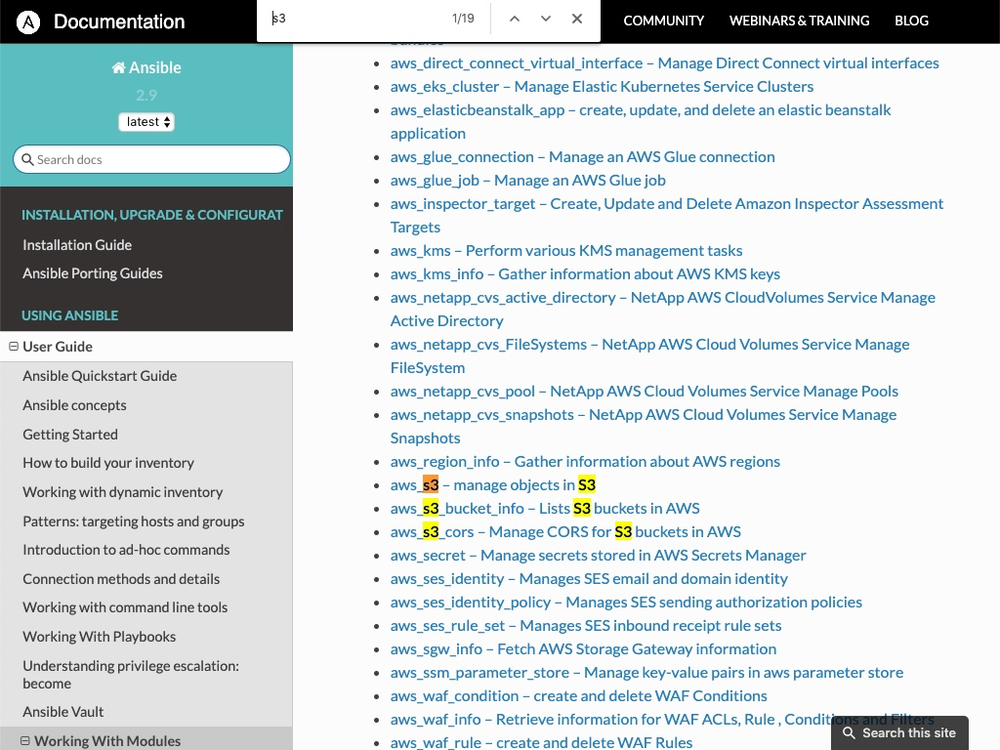
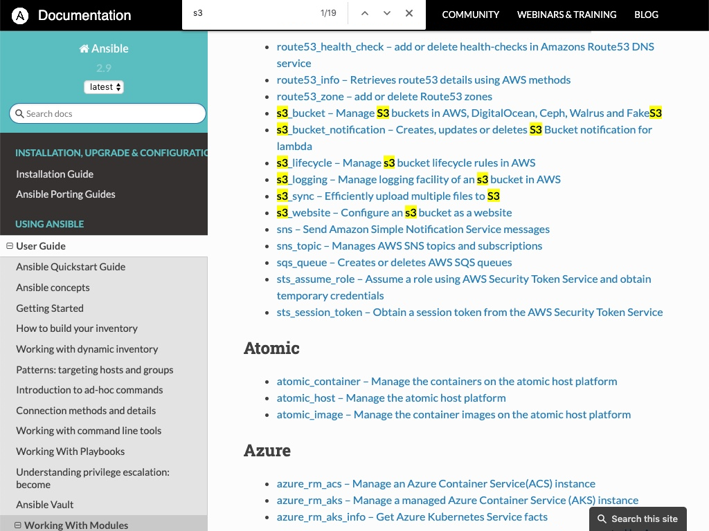
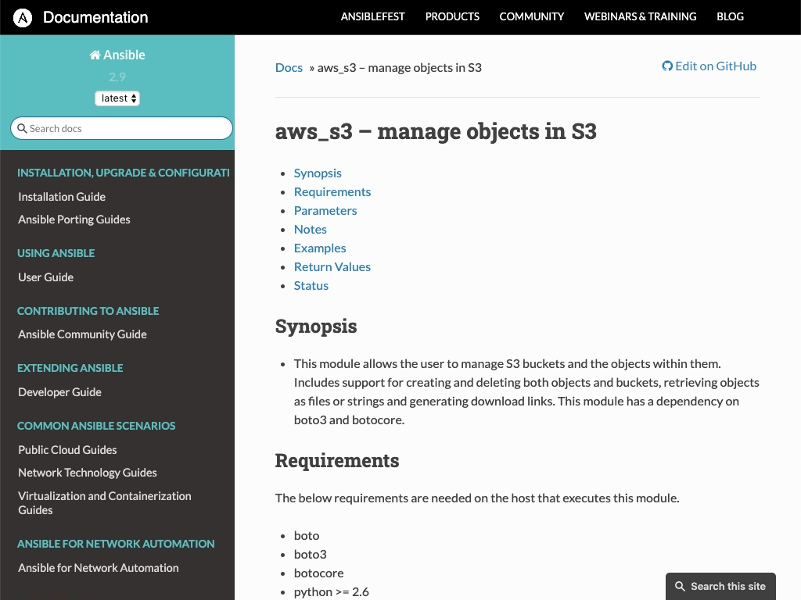
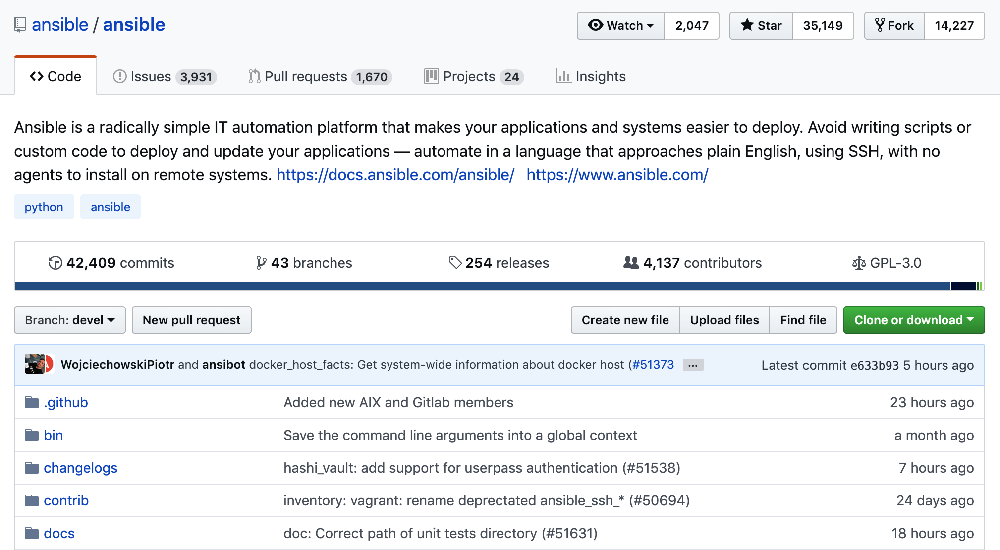
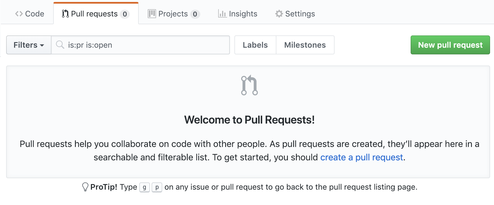
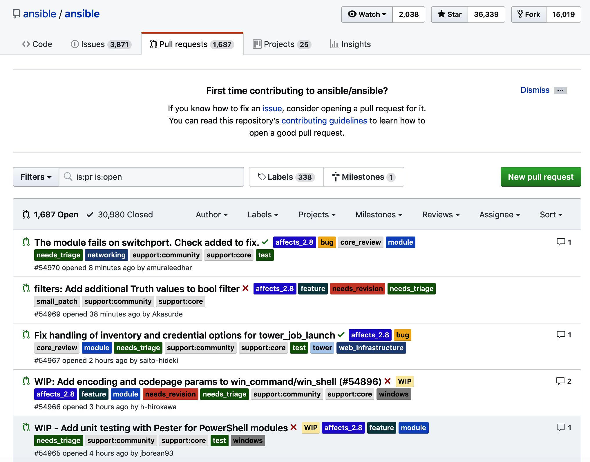

Lab 5. Consuming and Creating Modules
==============================


Specifically, in this lab, you will cover the following topics:

-   Executing multiple modules using the command line
-   Reviewing the module index
-   Accessing module documentation from the command line
-   Module return values
-   Developing custom modules

Let\'s get started!


#### Lab Environment

All lab file are present at below path. Run following command in the terminal first before running commands in the lab:

`cd ~/Desktop/ansible-course/Lab_5` 


Executing multiple modules using the command line
=================================================

As this lab is all about modules and how to create them, let\'s
recap how to use modules. We\'ve done this throughout this course, but we
have not drawn attention to some of the specifics related to how they
work. One of the key things we have not discussed is how the Ansible
engine talks to its modules and vice versa, so let\'s explore this now.

As ever, when working with Ansible commands, we need an inventory to run
our commands against. For this lab, as our focus is on the modules
themselves, we will use a very simple and small inventory, as shown
here:

```
[frontends]
frt01.example.com

[appservers]
app01.example.com
```

Now, for the first part of our recap, you can run a module very easily
via an ad hoc command and use the [-m] switch to tell Ansible
which module you want to run. Hence, one of the simplest commands you
can run is the Ansible [ping] command, as shown here:

```
$ ansible -i hosts appservers -m ping
```

Now, one thing we have not previously looked at is the communication
between Ansible and its modules; however, let\'s examine the output of
the preceding command:


```
$ ansible -i hosts appservers -m ping
app01.example.com | SUCCESS => {
    "ansible_facts": {
        "discovered_interpreter_python": "/usr/bin/python"
    },
    "changed": false,
    "ping": "pong"
}
```


Did you notice the structure of the output -- the curly braces, colons,
and commas? Yes, Ansible uses JSON-formatted data to talk to its
modules, and the modules report their data back to Ansible in JSON as
well. The preceding output is, in fact, a subset of the JSON-formatted
data returned to the Ansible engine by the [ping] module.


Now, let\'s run another command that takes an argument and passes that
data to the module:

```
$ ansible -i hosts appservers -m command -a "/bin/echo 'hello modules'"
```

In this case, we provided a single string as an argument to the command
module, which Ansible, in turn, converts into JSON and passes down to
the command module when it\'s invoked. When you run this ad hoc command,
you will see an output similar to the following:


```
$  ansible -i hosts appservers -m command -a "/bin/echo 'hello modules'"
app01.example.com | CHANGED | rc=0 >>
hello modules
```


In this instance, the output data does not appear to be JSON formatted;
however, what Ansible prints to the Terminal when you run a module is
only a subset of the data that each module returns -- for example, both
the [CHANGED] status and [rc=0] exit code from our command
were passed back to Ansible in a JSON-formatted data structure -- this
was just hidden from us.


Reviewing the module index
==========================

As discussed in the preceding section, Ansible provides thousands of
modules to make it fast and easy to develop playbooks and run them
across multiple host machines. How do you go about finding the right
module to begin with, though, when there are so many? Fortunately, the
Ansible documentation features a well-organized, categorized list of
modules that you can consult to find your desired module -- this is
available here:
<https://docs.ansible.com/ansible/latest/modules/modules_by_category.html>.

Let\'s suppose you want to see whether there is a native Ansible module
that can help you configure and manage your Amazon Web Services S3
buckets. That\'s a fairly precise, well-defined need, so let\'s approach
this in a logical manner:

1.  Begin by opening the categorized module index in your web browser,
    as discussed previously:

```
https://docs.ansible.com/ansible/latest/modules/modules_by_category.html
```

2.  Now, we know that Amazon Web Services is almost certainly going to
    feature in the [Cloud] modules category, so let\'s open that
    in our browser. 
3.  There are still hundreds, if not thousands, of modules listed on
    this page! So, let\'s use the [Find] function
    (*Ctrl* + *F*) in the browser to see whether the
    [s3] keyword appears anywhere:



We\'re in luck -- it does, and there are several more listings further
down the page:



We now have a shortlist of modules to work with -- granted, there are
several, so we still need to work out which one (or ones) we will need
for our playbook. As shown from the preceding short descriptions, this
will depend on what your intended task is.

4.  The short descriptions should be enough to give you some clues about
    whether the module will suit your needs or not. Once you have an
    idea, you can click on the appropriate document links to view more
    details about the module and how to work with it:




Accessing module documentation from the command line
====================================================


The following are some examples to show you how to interact with the
[ansible-doc] tool:

-   You can list all of the modules that there\'s documentation for on
    your Ansible control machine by simply issuing the following
    command:

```
$ ansible-doc -l
```

You should see an output similar to the following:

```
fortios_router_community_list          Configure community lists in Fortinet's FortiOS ...
azure_rm_devtestlab_info               Get Azure DevTest Lab facts
ecs_taskdefinition                     register a task definition in ecs
avi_alertscriptconfig                  Module for setup of AlertScriptConfig Avi RESTfu...
tower_receive                          Receive assets from Ansible Tower
netapp_e_iscsi_target                  NetApp E-Series manage iSCSI target configuratio...
azure_rm_acs                           Manage an Azure Container Service(ACS) instance
fortios_log_syslogd2_filter            Filters for remote system server in Fortinet's F...
junos_rpc                              Runs an arbitrary RPC over NetConf on an Juniper...
na_elementsw_vlan                      NetApp Element Software Manage VLAN
pn_ospf                                CLI command to add/remove ospf protocol to a vRo...
pn_snmp_vacm                           CLI command to create/modify/delete snmp-vacm
cp_mgmt_service_sctp                   Manages service-sctp objects on Check Point over...
onyx_ospf                              Manage OSPF protocol on Mellanox ONYX network de.
```

There are many pages of output, which just shows you how many modules
there are! In fact, you can count them:

```
$ ansible-doc -l | wc -l
3387
```

That\'s right -- 3,387 modules ship with Ansible 2.9.6!

-   As before, you can search for specific modules using your favorite
    shell tools to process the index; for example, you could
    [grep] for [s3] to find all of the S3-related modules,
    as we did interactively in the web browser in the previous section:

```
$ ansible-doc -l | grep s3
s3_bucket_notification                    Creates, upda...
purefb_s3user                             Create or del...
purefb_s3acc                              Create or del...
aws_s3_cors                               Manage CORS f...
s3_sync                                   Efficiently u...
s3_logging                                Manage loggin...
s3_website                                Configure an ...
s3_bucket                                 Manage S3 buc...
s3_lifecycle                              Manage s3 buc...
aws_s3_bucket_info                        Lists S3 buck...
aws_s3                                    manage object...
```

-   Now, we can easily look up the specific documentation for the module
    that interests us. Say we want to learn more about the
    [aws\_s3] module -- just as we did on the website, simply run
    the following:

```
$ ansible-doc aws_s3
```

This should produce an output similar to the following:

```
$ ansible-doc aws_s3
> AWS_S3 (/usr/lib/python2.7/site-packages/ansible/modules/cloud/amazon/aws_s

        This module allows the user to manage S3 buckets and the
        objects within them. Includes support for creating and
        deleting both objects and buckets, retrieving objects as files
        or strings and generating download links. This module has a
        dependency on boto3 and botocore.

  * This module is maintained by The Ansible Core Team
  * note: This module has a corresponding action plugin.

OPTIONS (= is mandatory):

- aws_access_key
        AWS access key id. If not set then the value of the
        AWS_ACCESS_KEY environment variable is used.
        (Aliases: ec2_access_key, access_key)[Default: (null)]
        type: str
....
```

Although the formatting is somewhat different, [ansible-doc] tells
us about the module, provides a list of all of the arguments
([OPTIONS]) that we can pass it, and as we scroll down, even gives
some working examples and possible return values. We shall explore the
topic of return values in the next section as they are important to
understand, especially as we approach the topic of developing our own
modules.


Module return values
====================

As we discussed earlier in this lab, Ansible modules return their
results as structured data, formatted behind the scenes in JSON. You
came across this return data in the previous example, both in the form
of exit code and where we used the [register] keyword to capture
the results of a task in an Ansible variable. In this section, we shall
explore how to discover the return values for an Ansible module so that
we can work with them later on in a playbook, for example, with
conditional processing.

Due to conserving space, we shall choose what is perhaps one of the
simplest Ansible modules to work with when it comes to return values
-- the [ping] module.

Without further ado, let\'s use the [ansible-doc] tool that we
learned about in the previous section and see what this says about the
return values for this module:

```
$ ansible-doc ping
```

If you scroll to the bottom of the output from the preceding command,
you should see something like this:

```
$ ansible-doc ping
...

RETURN VALUES:

ping:
    description: value provided with the data parameter
    returned: success
    type: str
    sample: pong
```


Hence, we can see that the [ping] module will only return one
value, and that is called [ping]. [description] tells us
what we should expect this particular return value to contain, while the
[returned] field tells us that it will only be returned on
[success] (if it would be returned on other conditions, these
would be listed here). The [type] return value is a string
(denoted by [str]), and although you can change the value with an
argument provided to the [ping] module, the default return value
(and hence [sample]) is [pong].

Now, let\'s see what that looks like in practice. For example, there\'s
nothing contained in those return values that would tell us whether the
module ran successfully and whether anything was changed; however, we
know that these are fundamental pieces of information about every module
run.

Let\'s put a very simple playbook together. We\'re going to run the
[ping] module with no arguments, capture the return values using
the [register] keyword, and then use the [debug] module to
dump the return values onto the Terminal:


```
---
- name: Simple play to demonstrate a return value
  hosts: localhost

  tasks:
    - name: Perform a simple module based task
      ping:
      register: pingresult

    - name: Display the result
      debug:
        var: pingresult
```

Now, let\'s see what happens when we run this playbook:

```
$ ansible-playbook retval.yml
[WARNING]: provided hosts list is empty, only localhost is available. Note that
the implicit localhost does not match 'all'

PLAY [Simple play to demonstrate a return value] *******************************

TASK [Gathering Facts] *********************************************************
ok: [localhost]

TASK [Perform a simple module based task] **************************************
ok: [localhost]

TASK [Display the result] ******************************************************
ok: [localhost] => {
    "pingresult": {
        "changed": false,
        "failed": false,
        "ping": "pong"
    }
}

PLAY RECAP *********************************************************************
localhost : ok=3 changed=0 unreachable=0 failed=0 skipped=0 rescued=0 ignored=0
```

Notice that the [ping] module does indeed return a value called
[ping], which contains the [pong] string (as the ping was
successful). However, you can see that there are, in fact, two
additional return values that were not listed in the Ansible
documentation. These accompany every single task run, and are hence
implicit -- that is to say, you can assume they will be among the data
that\'s returned from every module. The [changed] return value
will be set to [true] if the module run resulted in a change on
the target host, while the [failed] return value will be set to
[true] if the module run failed for some reason.

Using the [debug] module to print the output from a module run is
an incredibly useful trick if you want to gather more information about
a module, how it works, and what sort of data is returned. At this
point, we\'ve covered just about all of the fundamentals of working with
modules, so in the next section, we\'ll make a start on developing our
very own (simple) module.


Developing custom modules
=========================

Now that we\'re familiar with modules, how to call them, how to
interpret their results, and how to find documentation on them, we can
make a start on writing our own simple module. Although this will not
include the deep and intricate functionality of many of the modules that
ship with Ansible, it is hoped that this will give you enough
information to proceed with confidence when you build out your own, more
complex, ones.

One important point to note is that Ansible is written in Python, and as
such, so are its modules. As a result, you will need to write your
module in Python, and to get started with developing your own module,
you will need to make sure you have Python and a few essential tools
installed. If you are already running Ansible on your development
machine, you probably have the required packages installed, but if you
are starting from scratch, you will need to install Python, the Python
package manager ([pip]), and perhaps some other development
packages. The exact process will vary widely between operating systems,
but here are some examples to get you started:

-   On Fedora, you would run the following command to install the
    required packages:


```
$ sudo dnf install python python-devel
```

-   Similarly, on CentOS, you would run the following command to install
    the required packages:\

```
$ sudo apt install python python-devel
```

-   On Ubuntu, you would run the following commands to install the
    packages you need:

```
$ sudo apt-get update
$ sudo apt-get install python-pip python-dev build-essential 
```

-   If you are working on macOS and are using the Homebrew packaging
    system, the following command will install the packages you need:

```
$ sudo brew install python
```

Once you have the required packages installed, you will need to clone
the Ansible Git repository to your local machine as there are some
valuable scripts in there that we will need later on in the module
development process. Use the following command to clone the Ansible
repository to your current directory on your development machine:

```
$ git clone https://github.com/ansible/ansible.git
```

Finally (although optionally), it is good practice to develop your
Ansible modules in a virtual environment ([venv]) as this means
any Python packages you need to install go in here, rather than in with
your global system Python modules. Installing modules for the entire
system in an uncontrolled manner can, at times, cause compatibility
issues or even break local tools, and so although this is not a required
step, it is highly recommended.

The exact command to create a virtual environment for your Python module
development work will depend on both the operating system you are
running and the version of Python you are using. You should refer to the
documentation for your Linux distribution for more information; however,
the following commands were tested on CentOS 7.7 with the default Python
2.7.5 to create a virtual environment called [moduledev] inside
the Ansible source code directory you just cloned from GitHub:

```
$ cd ansible
$  python -m virtualenv moduledev
New python executable in /home/james/ansible/moduledev/bin/python
Installing setuptools, pip, wheel...done.
```

With our development environment set up, let\'s start writing our first
module. This module will be very simple as it\'s beyond the scope of
this course to provide an in-depth discussion around how to write large
amounts of Python code. However, we will code something that can use a
function from a Python library to copy a file locally on the target
machine.

Obviously, this overlaps heavily with existing module functionality, but
it will serve as a nice concise example of how to write a simple Python
program in a manner that allows Ansible to make use of it as a module.
Now, let\'s start coding our first module:

1.  In your preferred editor, create a new file called (for example)
    [remote\_filecopy.py]:

```
$ vi remote_filecopy.py
```

2.  Start with a shebang to indicate that this module should be executed
    with Python:

```
#!/usr/bin/python
```

3.  Although not mandatory, it is good practice to add copyright
    information, as well as your details, in the headers of your new
    module. By doing this, anyone using it will understand the terms
    under which they can use, modify, or redistribute it. The text given
    here is merely an example; you should investigate the various
    appropriate licenses for yourself and determine which is the best
    for your module:

```
# Copyright: (c) 2018, Jesse Keating <jesse.keating@example.org>
# GNU General Public License v3.0+ (see COPYING or https://www.gnu.org/licenses/gpl-3.0.txt)
```

4.  It is also good practice to add an Ansible metadata section that
    includes [metadata\_version], [status],
    and [supported\_by] information immediately after the
    copyright section. Note that the [metadata\_version] field
    represents the Ansible metadata version (which, at the time of
    writing, should be [1.1]) and is not related to the version of
    your module, nor the Ansible version you are using. The values
    suggested in the following code will be fine for just getting
    started, but if your module gets accepted into the official Ansible
    source code, they are likely to change:

```
ANSIBLE_METADATA = {'metadata_version': '1.1',
                    'status': ['preview'],
                    'supported_by': 'community'}
```

5.  Remember [ansible-doc] and that excellent documentation that
    is available on the Ansible documentation website? That all gets
    automatically generated from special sections you add to this file.
    Let\'s get started by adding the following code to our module:

```
DOCUMENTATION = '''
---
module: remote_filecopy
version_added: "2.9"
short_description: Copy a file on the remote host
description:
  - The remote_copy module copies a file on the remote host from a given source to a provided destination.
options:
  source:
    description:
      - Path to a file on the source file on the remote host
    required: True
  dest:
    description:
      - Path to the destination on the remote host for the copy
    required: True
author:
- Jesse Keating (@omgjlk)
'''
```

Pay particular attention to the [author] dictionary -- to pass the
syntax checks for inclusion in the official Ansible codebase, the
author\'s name should be appended with their GitHub ID in brackets. If
you don\'t do this, your module will still work, but it won\'t pass the
test we\'ll perform later.


Notice how the documentation is in YAML format, enclosed between triple
single quotes? The fields listed should be common to just about all
modules, but naturally, if your module takes different options, you
would specify these so that they match your module.


6.  The examples that you will find in the documentation are also
    generated from this file -- they have their own special
    documentation section immediately after [DOCUMENTATION] and
    should provide practical examples on how you might create a task
    using your module, as shown in the following example:

```
EXAMPLES = '''
   # Example from Ansible Playbooks
   - name: backup a config file
     remote_copy:
       source: /etc/herp/derp.conf
       dest: /root/herp-derp.conf.bak
'''
```

7.  The data that\'s returned by your module to Ansible should also be
    documented in its own section. Our example module will return the
    following values:

```
RETURN = '''
source:
  description: source file used for the copy
  returned: success
  type: str
  sample: "/path/to/file.name"
dest:
  description: destination of the copy
  returned: success
  type: str
  sample: "/path/to/destination.file"
gid:
  description: group ID of destination target
  returned: success
  type: int
  sample: 502
group:
  description: group name of destination target
  returned: success
  type: str
  sample: "users"
uid:
  description: owner ID of destination target
  returned: success
  type: int
  sample: 502
owner:
  description: owner name of destination target
  returned: success
  type: str
  sample: "fred"
mode:
  description: permissions of the destination target
  returned: success
  type: int
  sample: 0644
size:
  description: size of destination target
  returned: success
  type: int
  sample: 20
state:
  description: state of destination target
  returned: success
  type: str
  sample: "file"
'''
```

8.  Immediately after we have finished our documentation section, we
    should import any Python modules we\'re going to use. Here, we will
    include the [shutil] module, which will be used to perform our
    file copy:

```
import shutil
```

9.  Now that we\'ve built up the module headers and documentation, we
    can actually start working on the code. Now, you can see just how
    much effort goes into the documentation of every single Ansible
    module! Our module should start by defining a [main] function,
    in which we will create an object of
    the [AnsibleModule] type and use an [argument\_spec]
    dictionary to obtain the options that the module was called with:


```
 def main():
       module = AnsibleModule(
           argument_spec = dict(
               source=dict(required=True, type='str'),
               dest=dict(required=True, type='str')
           ) 
       )
```


10. At this stage, we have everything we need to write our module\'s
    functional code -- even the options that it was called with. Hence,
    we can use the Python [shutil] module to perform the local
    file copy, based on the arguments provided:

```
       shutil.copy(module.params['source'],
                   module.params['dest'])
```

11. At this point, we\'ve executed the task our module was designed to
    complete. However, it is fair to say that we\'re not done yet -- we
    need to exit the module cleanly and provide our return values to
    Ansible. Normally, at this point, you would write some conditional
    logic to detect whether the module was successful and whether it
    actually performed a change on the target host or not. However, for
    simplicity, we\'ll simply exit with the [changed] status every
    time -- expanding this logic and making the return status more
    meaningful is left as an exercise for you:

```
      module.exit_json(changed=True)
```

The [module.exit\_json] method comes from [AnsibleModule],
which we created earlier -- remember, we said it was important to know
that data was passed back and forth using JSON!

12. As we approach the end of our module code, we must now tell Python
    where it can import the [AnsibleModule] object from. This can
    be done with the following line of code:

```
   from ansible.module_utils.basic import *
```

13. Now for the final two lines of code for the module -- this is where
    we tell the module that it should be running the [main]
    function when it starts:

```
   if __name__ == '__main__':
       main()
```

That\'s it -- with a series of well-documented steps, you can write your
own Ansible modules in Python. The next step is, of course, to test it,
and before we actually test it in Ansible, let\'s see whether we can run
it manually in the shell. Of course, to make the module think it is
being run within Ansible, we must generate some arguments in -- you
guessed it -- JSON format. Create a file with the following contents to
provide the arguments:

```
{
    "ANSIBLE_MODULE_ARGS": {
        "source": "/tmp/foo",
        "dest": "/tmp/bar"
    }
}
```

Armed with this little snippet of JSON, you can execute your module
directly with Python. If you haven\'t already done so, you\'ll need to
set up your Ansible development environment as follows. Note that we
also manually create the source file, [/tmp/foo], so that our
module can really perform the file copy:


```
$ touch /tmp/foo
$ . moduledev/bin/activate
(moduledev) $ . hacking/env-setup
running egg_info
creating lib/ansible_base.egg-info
writing requirements to lib/ansible_base.egg-info/requires.txt
writing lib/ansible_base.egg-info/PKG-INFO
writing top-level names to lib/ansible_base.egg-info/top_level.txt
writing dependency_links to lib/ansible_base.egg-info/dependency_links.txt
writing manifest file 'lib/ansible_base.egg-info/SOURCES.txt'
reading manifest file 'lib/ansible_base.egg-info/SOURCES.txt'
reading manifest template 'MANIFEST.in'
warning: no files found matching 'SYMLINK_CACHE.json'
warning: no previously-included files found matching 'docs/docsite/rst_warnings'
warning: no previously-included files matching '*' found under directory 'docs/docsite/_build'
warning: no previously-included files matching '*.pyc' found under directory 'docs/docsite/_extensions'
warning: no previously-included files matching '*.pyo' found under directory 'docs/docsite/_extensions'
warning: no files found matching '*.ps1' under directory 'lib/ansible/modules/windows'
warning: no files found matching '*.psm1' under directory 'test/support'
writing manifest file 'lib/ansible_base.egg-info/SOURCES.txt'

Setting up Ansible to run out of checkout...

PATH=/home/james/ansible/bin:/home/james/ansible/moduledev/bin:/usr/local/sbin:/usr/local/bin:/usr/sbin:/usr/bin:/home/james/bin
PYTHONPATH=/home/james/ansible/lib
MANPATH=/home/james/ansible/docs/man:/usr/local/share/man:/usr/share/man

Remember, you may wish to specify your host file with -i

Done!
```


Now, you\'re finally ready to run your module for the first time. You
can do this as follows:

```
(moduledev) $ python remote_filecopy.py args.json
{"invocation": {"module_args": {"dest": "/tmp/bar", "source": "/tmp/foo"}}, "changed": true}

(moduledev) $ ls -l /tmp/bar
-rw-r--r-- 1 root root 0 Apr 16 16:24 /tmp/bar
```

Success! Your module works -- and it both ingests and produces JSON
data, as we discussed earlier in this lab. Of course, there\'s much
more to add to your module -- we\'ve not addressed [failed] or
[ok] returns from the module, nor does it support check mode.
However, we\'re off to a flying start, and if you want to learn more
about Ansible modules and fleshing out your functionality, you can find
more details
here: <https://docs.ansible.com/ansible/latest/dev_guide/developing_modules_general.html>.

Note that when it comes to testing your module, creating arguments in a
JSON file is hardly intuitive, although, as we have seen, it does work
well. Luckily for us, it is easy to run our Ansible module in a
playbook! By default, Ansible will check the playbook directory for a
subdirectory called [library/] and will run referenced modules
from here. Hence, we might create the following:

```
$ cd ~
$ mkdir testplaybook
$ cd testplaybook
$ mkdir library
$ cp ~/ansible/moduledev/remote_filecopy.py library/
```

Now, create a simple inventory file in this playbook directory, just as
we did previously, and add a playbook with the following contents:

```
---
- name: Playbook to test custom module
  hosts: all

  tasks:
    - name: Test the custom module
      remote_filecopy:
        source: /tmp/foo
        dest: /tmp/bar
      register: testresult

    - name: Print the test result data
      debug:
        var: testresult
```

For the purposes of clarity, your final directory structure should look
like this:

```
testplaybook
├── hosts
├── library
│   └── remote_filecopy.py
└── testplaybook.yml
```

Now, try running the playbook in the usual manner and see what happens:

```
$ ansible-playbook -i hosts testplaybook.yml

PLAY [Playbook to test custom module] ******************************************

TASK [Gathering Facts] *********************************************************
ok: [frt01.example.com]
ok: [app01.example.com]

TASK [Test the custom module] **************************************************
changed: [app01.example.com]
changed: [frt01.example.com]

TASK [Print the test result data] **********************************************
ok: [app01.example.com] => {
    "testresult": {
        "changed": true,
        "failed": false
    }
}
ok: [frt01.example.com] => {
    "testresult": {
        "changed": true,
        "failed": false
    }
}

PLAY RECAP *********************************************************************
app01.example.com : ok=3 changed=1 unreachable=0 failed=0 skipped=0 rescued=0 ignored=0
frt01.example.com : ok=3 changed=1 unreachable=0 failed=0 skipped=0 rescued=0 ignored=0
```

Success! Not only have you tested your Python code locally, but you have
also successfully run it on two remote servers in an Ansible playbook.
That was really easy, which just proves how straightforward it is to get
started expanding your Ansible modules to meet your own bespoke needs.

Despite the success of running this piece of code, we\'ve not checked
the documentation yet, nor tested its operation from Ansible. Before we
address these issues in more detail, in the next section, we\'ll take a
look at some of the common pitfalls of module development and how to
avoid them.


Avoiding common pitfalls
------------------------


One piece of overall guidance before we get started is that just like
documentation receives a high degree of attention in Ansible, so should
your error messages. They should be meaningful and easy to interpret,
and you should steer clear of meaningless strings such as
[Error!]. 

So, right now, if we remove the source file that we\'re attempting to
copy and then rerun our module with the same arguments, I think you\'ll
agree that the output is neither pretty nor meaningful, unless you
happen to be a hardened Python developer:

```
(moduledev) $ rm -f /tmp/foo
(moduledev) $ python remote_filecopy.py args.json
Traceback (most recent call last):
  File "remote_filecopy.py", line 99, in <module>
    main()
  File "remote_filecopy.py", line 93, in main
    module.params['dest'])
  File "/usr/lib64/python2.7/shutil.py", line 119, in copy
    copyfile(src, dst)
  File "/usr/lib64/python2.7/shutil.py", line 82, in copyfile
    with open(src, 'rb') as fsrc:
IOError: [Errno 2] No such file or directory: '/tmp/foo'
```

We can, without a doubt, do better. Let\'s make a copy of our module and
add a little code to it. First of all, replace the [shutil.copy]
lines of code with the following:

```
    try:
       shutil.copy(module.params['source'], module.params['dest'])
    except:
       module.fail_json(msg="Failed to copy file")
```


Now, when we try and run the module with a non-existent source file, we
will see the following cleanly formatted JSON output:

```
(moduledev) $ rm -f /tmp/foo
(moduledev) $ python better_remote_filecopy.py args.json

{"msg": "Failed to copy file", "failed": true, "invocation": {"module_args": {"dest": "/tmp/bar", "source": "/tmp/foo"}}}
```

However, the module still works in the same manner as before if the copy
succeeds:

```
(moduledev) $ touch /tmp/foo
(moduledev) $ python better_remote_filecopy.py args.json

{"invocation": {"module_args": {"dest": "/tmp/bar", "source": "/tmp/foo"}}, "changed": true}
```

With this simple change to our code, we can now cleanly and gracefully
handle the failure of the file copy operation and report something more
meaningful back to the user rather than using a traceback.


Testing and documenting your module
-----------------------------------


Before we get into actually viewing our documentation, we should make
use of a tool called [ansible-test], which was newly added in the
2.9 release. This tool can perform a sanity check on our module code to
ensure that our documentation meets all the standards required by the
Ansible project team and that the code is structured correctly (for
example, the Python [import] statements should always come after
the documentation blocks). Let\'s get started:

1.  To run the sanity tests, assuming you have cloned the official
    repository, change into this directory and set up your environment.
    Note that if your standard Python binary isn\'t Python 3, the
    [ansible-test] tool will not run, so you should ensure Python
    3 is installed and, if necessary, set up a virtual environment to
    ensure you are using Python 3. This can be done as follows:

```
$ cd ansible$ python 3 -m venv venv
$ . venv/bin/activate
(venv) $ source hacking/env-setup
running egg_info
creating lib/ansible.egg-info
writing lib/ansible.egg-info/PKG-INFO
writing dependency_links to lib/ansible.egg-info/dependency_links.txt
writing requirements to lib/ansible.egg-info/requires.txt
writing top-level names to lib/ansible.egg-info/top_level.txt
writing manifest file 'lib/ansible.egg-info/SOURCES.txt'
reading manifest file 'lib/ansible.egg-info/SOURCES.txt'
reading manifest template 'MANIFEST.in'
warning: no files found matching 'SYMLINK_CACHE.json'
writing manifest file 'lib/ansible.egg-info/SOURCES.txt'

Setting up Ansible to run out of checkout...

PATH=/home/james/ansible/bin:/home/james/ansible/venv/bin:/usr/local/sbin:/usr/local/bin:/usr/sbin:/usr/bin:/home/james/bin
PYTHONPATH=/home/james/ansible/lib
MANPATH=/home/james/ansible/docs/man:/usr/local/share/man:/usr/share/man

Remember, you may wish to specify your host file with -i

Done!
```

2.  Next, use [pip] to install the Python requirements so that you
    can run the [ansible-test] tool:

```
(venv) $ pip3 install -r test/runner/requirements/sanity.txt
```

3.  Now, provided you have copied your module code into the appropriate
    location in the source tree (an example copy command is shown here),
    you can run the sanity tests as follows:

```
(venv) $ cp ~/moduledev/remote_filecopy.py ./lib/ansible/modules/files/
(venv) $ ansible-test sanity --test validate-modules remote_filecopy
Sanity check using validate-modules
WARNING: Cannot perform module comparison against the base branch. Base branch not detected when running locally.
WARNING: Reviewing previous 1 warning(s):
WARNING: Cannot perform module comparison against the base branch. Base branch not detected when running locally.
```

From the preceding output, you can see that apart from one warning
related to us not having a base branch to compare against, the module
code that we developed earlier in this lab has passed all the tests.
If you had an issue with the documentation (for example, the author name
format was incorrect), this would be given as an error.

Now that we have passed the sanity checks with [ansible-test],
let\'s see whether the documentation looks right by using the
[ansible-doc] command. This is very easy to do. First of all, exit
your virtual environment, if you are still in it, and change to the
Ansible source code directory you cloned from GitHub earlier. Now, you
can manually tell [ansible-doc] where to look for modules instead
of the default path. This means that you could run the following:

```
$ cd ~/ansible
$ ansible-doc -M moduledev/ remote_filecopy
```

You should be presented with the textual rendering of the documentation
we created earlier -- an example of the first page is shown here to give
you an idea of how it should look:

```
> REMOTE_FILECOPY (/home/james/ansible/moduledev/remote_filecopy.py)

        The remote_copy module copies a file on the remote host from a
        given source to a provided destination.

  * This module is maintained by The Ansible Community
OPTIONS (= is mandatory):

= dest
        Path to the destination on the remote host for the copy


= source
        Path to a file on the source file on the remote host
```

Excellent! So, we can already access our module documentation using
[ansible-doc] and indeed confirm that it renders correctly in text
mode. However, how do we go about building the HTML version?
Fortunately, there is a well-defined process for this, which we shall
outline here:

1.  Under [lib/ansible/modules/], you will find a series of
    categorized directories that modules are placed under -- ours fits
    best under the [files] category, so copy it to this location
    in preparation for the build process to come:

```
$ cp moduledev/remote_filecopy.py lib/ansible/modules/files/
```

2.  Change to the [docs/docsite/] directory as the next step in
    the documentation creation process:

```
$ cd docs/docsite/
```

3.  Build a documentation-based Python file. Use the following command
    to do so:

```
$ MODULES=hello_module make webdocs
```


Once I\'d started working from the Ansible v2.8.10 source tree, I had to
make sure I had removed any preexisting [sphinx] modules from my
Python 3 environment (you need Python 3.5 or above to build the
documentation locally -- if you don\'t have this installed on your node,
please do this before proceeding) and then ran the following commands:

```
$ pip3 uninstall sphinx
$ pip3 install sphinx==2.4.4
$ pip3 install sphinx-notfound-page
```

With this in place, you will be able to successfully run [make
webdocs] to build your documentation. You will see pages of
output. A successful run should end with something like the output shown
here:

```
generating indices... genindex py-modindexdone
writing additional pages... search/home/james/ansible/docs/docsite/_themes/sphinx_rtd_theme/search.html:21: RemovedInSphinx30Warning: To modify script_files in the theme is deprecated. Please insert a <script> tag directly in your theme instead.
  
 opensearchdone
copying images... [100%] dev_guide/style_guide/images/thenvsthan.jpg
copying downloadable files... [ 50%] network/getting_started/sample_files/first_copying downloadable files... [100%] network/getting_started/sample_files/first_playbook_ext.yml
copying static files... ... done
copying extra files... done
dumping search index in English (code: en)... done
dumping object inventory... done
build succeeded, 35 warnings.

The HTML pages are in _build/html.
make[1]: Leaving directory `/home/james/ansible/docs/docsite'
```


Now, notice how, at the end of this process, the [make] command
tells us where to look for the compiled documentation. If you look in
here, you will find the following:

```
$ find /home/james/ansible/docs/docsite -name remote_filecopy*
/home/james/ansible/docs/docsite/rst/modules/remote_filecopy_module.rst
/home/james/ansible/docs/docsite/_build/html/modules/remote_filecopy_module.html
/home/james/ansible/docs/docsite/_build/doctrees/modules/remote_filecopy_module.doctree
```

Try opening up the HTML file in your web browser -- you should see that
the page renders just like one of the documentation pages from the
official Ansible project documentation! This enables you to check that
your documentation builds correctly and looks and reads well in the
context that it will be viewed in. It also gives you confidence that,
when you submit your code to the Ansible project (if you are doing so),
you are submitting something consistent with Ansible\'s documentation
quality standards.


Contributing upstream -- submitting a GitHub pull request
---------------------------------------------------------


To submit your module as a pull request of the Ansible repository, you
need to fork the [devel] branch of the official Ansible
repository. To do this, log into your GitHub account from your web
browser (or create an account if you don\'t already have one), and then
navigate to the URL shown in the following screenshot. Click
[Fork] in the top-right corner. As a reminder, the
official Ansible source code repository URL
is <https://github.com/ansible/ansible.git>:



Now that you have forked the repository to your own account, we will
walk through the commands you need to run in order to add your
module code to it. Then, we\'ll show you how to create the required
**pull requests** (also known as **PRs**) so that you can merge your new
module with the upstream Ansible project:

1.  Clone the [devel] branch that you\'ve just forked to your
    local machine. Use a command similar to the following, but be sure
    to replace the URL with the one that matches your own GitHub
    account:

```
$ git clone https://github.com/fenago/ansible.git
```

2.  Copy your module code into the appropriate modules directory -- the
    [copy] command given in the following code is just an example
    to give you a clue as to what to do, but in reality, you should
    choose the appropriate category subdirectory for your module as it
    won\'t necessarily fit into the [files] category. Once you\'ve
    added your Python file, perform [git add] to make Git aware of
    the new file, and then commit it with a meaningful commit message.
    Some example commands are as follows:

```
$ cd ansible
$ cp ~/ansible-development/moduledev/remote_filecopy.py ./lib/ansible/modules/files/
$ git add lib/ansible/modules/files/remote_filecopy.py
$ git commit -m 'Added tested version of remote_filecopy.py for pull request creation'
```

3.  Now, be sure to push the code to your forked repository using the
    following command:

```
$ git push
```

4.  Return to GitHub in your web browser and navigate to the [Pull Requests] page, as shown here. Click the [New pull request] button:



Follow the pull request creation process through, as guided by the
GitHub website. Once you have successfully submitted your pull request,
you should be able to navigate to the list of pull requests on the
official Ansible source code repository and find yours there. An example
of the pull requests list is shown here for your reference:





Summary
=======


In this lab, we started with a recap of how to execute multiple
modules using the command line. We then explored the process of
interrogating the current module index, as well as how to obtain
documentation about modules to evaluate their suitability for our needs,
regardless of whether we have an active internet connection or not. We
then explored module data and its JSON format, before finally going on a
journey through which we put together the code for a simple custom
module. This provided you with a basis for creating your own modules in
the future, if you so desire.

In the next lab, we will explore the process of using and creating
another core Ansible feature, known as plugins.


Questions
=========

1.  Which command line can be passed down as a parameter to a module?

A\) [ansible dbservers -m command \"/bin/echo \'hello modules\'\"]

B\) [ansible dbservers -m command -d \"/bin/echo \'hello
modules\'\"]

C\) [ansible dbservers -z command -a \"/bin/echo \'hello
modules\'\"]

D\) [ansible dbservers -m command -a \"/bin/echo \'hello
modules\'\"]

E\) [ansible dbservers -a \"/bin/echo \'hello modules\'\"]

2.  Which of the following practices is not recommended when you create
    a custom module and address exceptions?

A\) Design a custom module simply and never provide a traceback to the
user, if you can avoid it.

B\) Fail your module code quickly, and verify that you are providing
helpful and understandable exception messages.

C\) Only display error messages for the most relevant exceptions, rather
than all possible errors.

D\) Ensure that your module documentation is relevant and easy to
understand.

E\) Delete playbooks that result in errors and then recreate them from
scratch.

3.  True or False: To contribute to the Ansible upstream project, you
    need to submit your code to the [devel] branch. 

A\) True

B\) False


