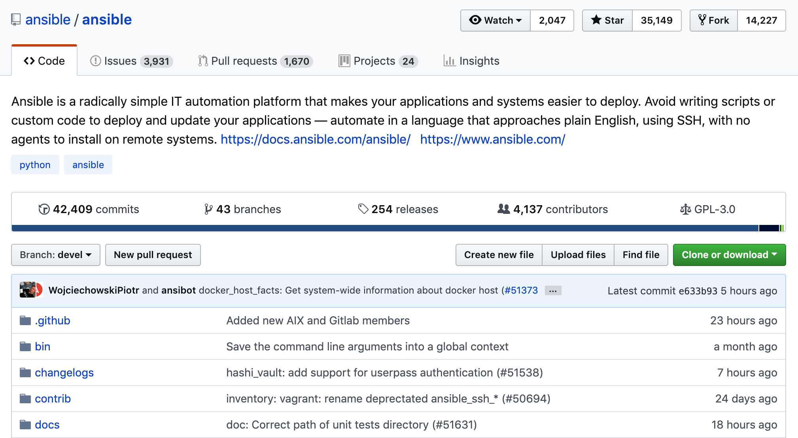
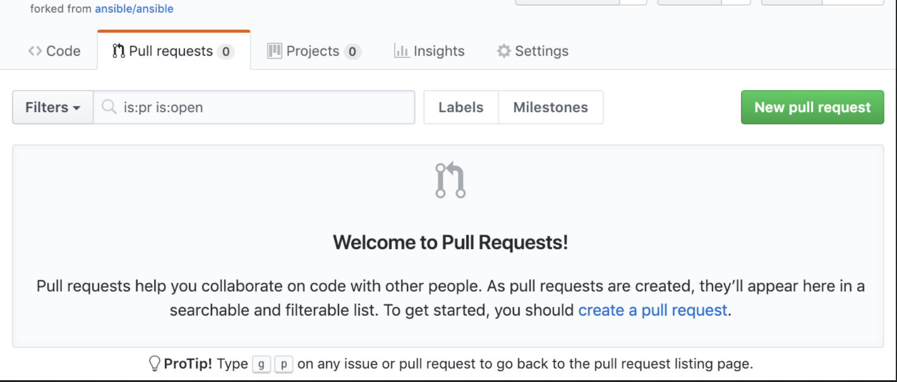
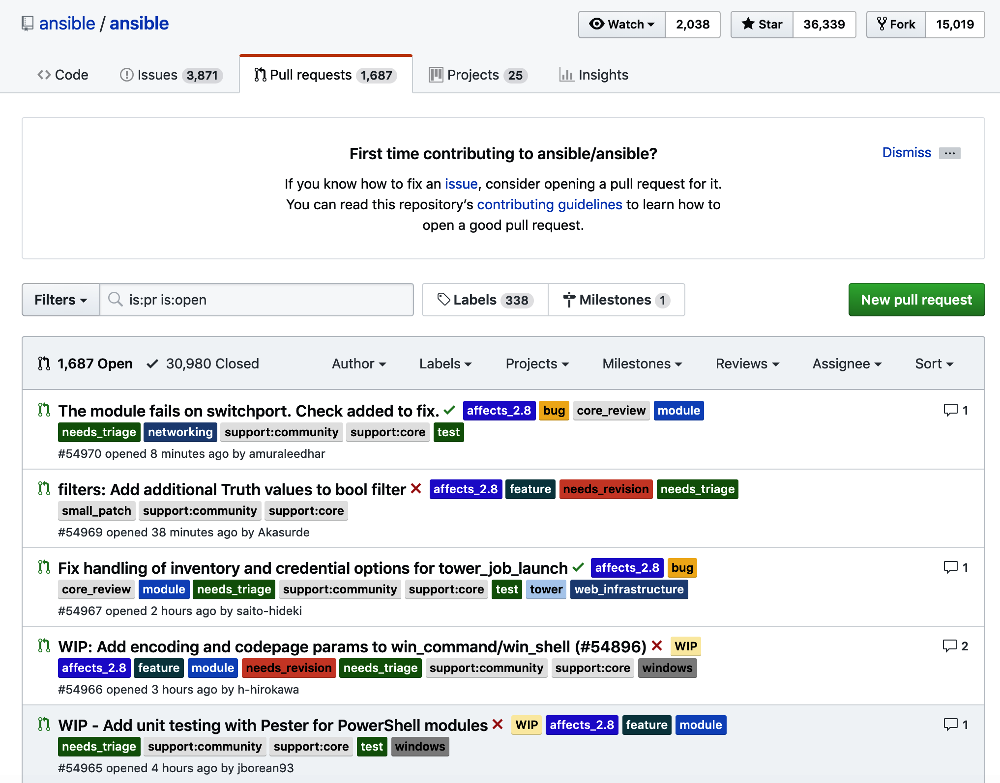

Lab 6. Consuming and Creating Plugins
==============================


In this lab, we will cover the following topics:

-   Discovering the plugin types
-   Finding the included plugins
-   Creating custom plugins


#### Lab Environment

All lab file are present at below path. Close all terminals and run following command in the **new**  terminal first before running commands in the lab:

`cd ~/Desktop/ansible-course/Lab_6` 


Discovering the plugin types
============================

Let\'s validate the presence of a suitably installed version of
Ansible on your test machine before proceeding further:

```
$  ansible-doc --version

ansible-doc 2.9.6
  config file = /etc/ansible/ansible.cfg
  configured module search path = ['/root/.ansible/plugins/modules', '/usr/share/ansible/plugins/modules']
  ansible python module location = /usr/lib/python3/dist-packages/ansible
  executable location = /usr/bin/ansible-doc
  python version = 3.8.5 (default, Jan 27 2021, 15:41:15) [GCC 9.3.0]
```

### Exercise

We will leave exploring the plugin documentation on the Ansible website
as an exercise for you to complete. However, if you want to explore the
various plugins using the [ansible-doc] tool, you would need to
run the following commands:

1.  To use the [ansible-doc] command to list all the plugins
    available in a given category, you can run the following command:

```
$ ansible-doc -t connection -l
```

This will return a textual index of the connection plugins, similar to
what we saw when we were looking at the module documentation. The first
few lines of the index output are shown here:

```
kubectl           Execute tasks in pods running on Kubernetes
napalm            Provides persistent connection using NAPALM
qubes             Interact with an existing QubesOS AppVM
libvirt_lxc       Run tasks in lxc containers via libvirt
funcd             Use funcd to connect to target
chroot            Interact with local chroot
psrp              Run tasks over Microsoft PowerShell Remoting Protocol
zone              Run tasks in a zone instance
winrm             Run tasks over Microsoft's WinRM
paramiko_ssh      Run tasks via python ssh (paramiko)
```

2.  You can then explore the documentation for a given plugin. For
    example, if we want to learn about the [paramiko\_ssh] plugin,
    we can issue the following command:

```
$ ansible-doc -t connection paramiko_ssh
```


```
> PARAMIKO (/usr/lib/python3/dist-packages/ansible/plugins/connection/param

        Use the python ssh implementation (Paramiko) to connect to
        targets The paramiko transport is provided because many
        distributions, in particular EL6 and before do not support
        ControlPersist in their SSH implementations. This is needed on
        the Ansible control machine to be reasonably efficient with
        connections. Thus paramiko is faster for most users on these
        platforms. Users with ControlPersist capability can consider
        using -c ssh or configuring the transport in the configuration
        file. This plugin also borrows a lot of settings from the ssh
        plugin as they both cover the same protocol.

  * This module is maintained by The Ansible Community
OPTIONS (= is mandatory):

- host_key_auto_add
        TODO: write it
        [Default: (null)]
        set_via:
          env:
          - name: ANSIBLE_PARAMIKO_HOST_KEY_AUTO_ADD
          ini:
          - key: host_key_auto_add
```

Thanks to all the hard work and effort that goes into documenting every
area of Ansible, you can easily find out about the plugins that are
included with Ansible and how to work with them. So far, we have seen
that the documentation for plugins is no less complete than it is for
modules. In the next section of this lab, we\'ll dive a bit deeper
into how to find the plugin code that accompanies your Ansible
distribution.


Finding included plugins
========================


If you installed Ansible on a Linux system using a package manager (that
is, via an RPM or DEB package), then the location of your plugins will
depend on your OS. For example, on my test CentOS 7 system where I
installed Ansible from the official RPM package, I can see the plugins
installed here:

```
$ find /usr/lib/ -name *ansible*
$ ls -ltr /usr/lib/python3/dist-packages/ansible/plugins/
```


Notice how the plugins are separated into subdirectories, all named
after their categories. If we want to look up the [paramiko\_ssh]
plugin that we reviewed the documentation of in the preceding section,
we can look in the [connection/] subdirectory:

```
$ ls -l /usr/lib/python3/dist-packages/ansible/plugins/connection/paramiko_ssh.py

-rw-r--r-- 1 root root 23544 Mar 5 05:39 /usr/lib/python3/dist-packages/ansible/plugins/connection/paramiko_ssh.py
```

As one of our goals in this lab is to write our own simple custom plugin, let\'s look at how to find the
plugins in the official Ansible source code:

1.  Clone the official Ansible repository from GitHub, as we did
    previously, and change the directory to the location of your clone:

```
$ cd ~ && rm -r ansible     # delete existing clone
$ git clone https://github.com/ansible/ansible.git
$ cd ansible
```

2.  Within the official source code directory structure, you will find
    that the plugins are all contained (again, in categorized
    subdirectories) under [lib/ansible/plugins/]:

```
$ cd lib/ansible/plugins
```

3.  We can explore the connection-based plugins by looking in the
    [connection] directory:

```
$ ls -al connection/
```


The exact contents of this directory will depend on the version of
Ansible source code that you have cloned. At the time of writing, it
looks as follows, with one Python file for each plugin :


```
$ ls -al connection/

total 176

drwxr-xr-x 2 root root 109 Apr 15 17:24 .
drwxr-xr-x 19 root root 297 Apr 15 17:24 ..
-rw-r--r-- 1 root root 16411 Apr 15 17:24 __init__.py
-rw-r--r-- 1 root root 6855 Apr 15 17:24 local.py
-rw-r--r-- 1 root root 23525 Apr 15 17:24 paramiko_ssh.py
-rw-r--r-- 1 root root 32839 Apr 15 17:24 psrp.py
-rw-r--r-- 1 root root 55367 Apr 15 17:24 ssh.py
-rw-r--r-- 1 root root 31277 Apr 15 17:24 winrm.py
```


4.  You can review the contents of each plugin to learn more about how
    they work, which is again part of the beauty of open source
    software:

```
$ less connection/paramiko_ssh.py
```

An example of the beginning of this file is shown in the following code
block to give you an idea of the kind of output you should be seeing if
this command runs correctly:

```
# (c) 2012, Michael DeHaan <michael.dehaan@gmail.com>
# (c) 2017 Ansible Project
# GNU General Public License v3.0+ (see COPYING or https://www.gnu.org/licenses/gpl-3.0.txt)
from __future__ import (absolute_import, division, print_function)
__metaclass__ = type

DOCUMENTATION = """
    author: Ansible Core Team
    connection: paramiko
    short_description: Run tasks via python ssh (paramiko)
    description:
        - Use the python ssh implementation (Paramiko) to connect to targets
        - The paramiko transport is provided because many distributions, in particular EL6 and before do not support ControlPersist
          in their SSH implementations.
....
```


Notice the [DOCUMENTATION] block, which is very similar to what we
saw when we were working with the module source code. If you explore the
source code of each plugin, you will find that the structure bears some
similarity to the module code structure. However, rather than simply
taking this statement at face value, in the next section, let\'s get
started with building our very own custom plugin to learn, through a
practical example, how they are put together.


Creating custom plugins
=======================


`cd ~/ansible`

Let\'s get started on creating our simple filter plugin. As we are only
creating one, it will live in its own single Python file. You could
propose a modification to one of the Ansible core filter Python files if
you want to submit your code back to the Ansible project; but for now,
we\'ll leave that as a project for you to complete yourself. Our filter
file will be called [custom\_filter.py] and it will live in a
directory called [filter\_plugins], which must be in the same
directory as your playbook.

Perform the following steps to create and test your plugin code:

1.  Start your plugin file with a header so that people will know who
    wrote the plugin and what license it is released under. Naturally,
    you should update both the copyright and license fields with values
    appropriate to your plugin, but the following text is given as an
    example for you to get started with:

```
# (c) 2020, Fenago <ansible@fenago.com>
# GNU General Public License v3.0+ (see COPYING or https://www.gnu.org/licenses/gpl-3.0.txt)
```

2.  Next, we\'ll add a very simple Python function---yours can be as
    complex as you want it to be, but for ours, we will simply use the
    Python [.replace] function to replace one string with another
    inside a [string] variable. The following example looks for
    instances of [Puppet] and replaces them with [Ansible]:

```
def improve_automation(a):
 return a.replace("Puppet", "Ansible")
```

3.  Next, we need to create an object of the [FilterModule] class,
    which is how Ansible will know that this Python file contains a
    filter. Within this object, we can create a [filters]
    definition and return the value of our previously defined filter
    function to Ansible:

```
class FilterModule(object):
       '''improve_automation filters'''
       def filters(self):
           return {'improve_automation': improve_automation}
```

4.  As you can see, this code is all incredibly simple and we\'re able
    to use built-in Python functions, such as [replace], to
    manipulate the strings. There isn\'t a specific test harness for
    plugins in Ansible, so we will test out our plugin code by writing a
    simple playbook that will implement it. The following playbook code
    defines a simple string that includes the word [Puppet] in it
    and prints this to the console using the [debug] module,
    applying our newly defined filter to the string:


```
---
- name: Play to demonstrate our custom filter
  hosts: frontends
  gather_facts: false
  vars:
    statement: "Puppet is an excellent automation tool!"

  tasks:
    - name: make a statement
      debug:
        msg: "{{ statement | improve_automation }}"
```


Now, before we attempt to run this, let\'s recap what the directory
structure should look like. Just as we were able to utilize the custom
module that we created in Lab 5, by creating a [library/]
subdirectory to house our module, we can also create a
[filter\_plugins/] subdirectory for our plugin. Your directory
tree structure, when you have finished coding the various file details
in the preceding code block, should look something like this:

```
.
├── filter_plugins
│   ├── custom_filter.py
├── hosts
├── myplugin.yml
```

Let\'s now run our little test playbook and see what output we get. If
all goes well, it should look something like the following:


```
$ cd ~/Desktop/ansible-course/Lab_6/
$ ansible-playbook -i hosts myplugin.yml


PLAY [Play to demonstrate our custom filter] ***********************************

TASK [make a statement] ********************************************************
ok: [frt01.example.com] => {
    "msg": "Ansible is an excellent automation tool!"
}

PLAY RECAP *********************************************************************
frt01.example.com : ok=1 changed=0 unreachable=0 failed=0 skipped=0 rescued=0 ignored=0
```


As you can see, our new filter plugin replaced the
[Puppet] string in our variable\'s contents and replaced it with the [Ansible] string.


As an example of this, let\'s repeat the preceding process, but to
create a [lookup] plugin, instead. This plugin will be based
heavily on a simplified version of the file [lookup] plugin.
If you intend to test
this from a playbook, as executed previously, you should create this in
a directory called [lookup\_plugins/]:

1.  Start by adding a header to the plugin file, as before, so that the
    maintainer and copyright details are clear. We are borrowing a large
    chunk of the original [file.py] [lookup] plugin code for
    our example, so it is important we include the relevant credit:

```
# (c) 2020, Fenago <ansible@fenago.com>
# (c) 2017 Ansible Project
# GNU General Public License v3.0+ (see COPYING or https://www.gnu.org/licenses/gpl-3.0.txt)
```

2.  Next, add in the Python 3 headers---these are an absolute
    requirement if you intend to submit your plugin via a **Pull Request** (**PR**) to the Ansible project:

```
from __future__ import (absolute_import, division, print_function)
__metaclass__ = type
```

3.  Next, add a [DOCUMENTATION] block to your plugin so that other
    users can understand how to interact with it:

```
DOCUMENTATION = """
    lookup: firstchar
    author: Fenago <ansible@fenago.com>
    version_added: "2.9"
    short_description: read the first character of file contents
    description:
        - This lookup returns the first character of the contents from a file on the Ansible controller's file system.
    options:
      _terms:
        description: path(s) of files to read
        required: True
    notes:
      - if read in variable context, the file can be interpreted as YAML if the content is valid to the parser.
      - this lookup does not understand 'globing', use the fileglob lookup instead.
"""
```

4.  Add the relevant [EXAMPLES] blocks to show how to use your
    plugin, just as we did for modules:

```
EXAMPLES = """
- debug: msg="the first character in foo.txt is {{lookup('firstchar', '/etc/foo.txt') }}"

"""
```

5.  Also, make sure you document the [RETURN] values from your
    plugin:

```
RETURN = """
  _raw:
    description:
      - first character of content of file(s)
"""
```

6.  With the documentation complete, we can now start to work on our
    Python code. We will start by importing all the Python modules we
    need to make our module work. We\'ll also set up the [display]
    object, which is used in verbose output and debugging. This should
    be used in place of the [print] statements in your plugin code
    if you need to display the [debug] output:

```
from ansible.errors import AnsibleError, AnsibleParserError
from ansible.plugins.lookup import LookupBase
from ansible.utils.display import Display

display = Display()
```

7.  We will now create an object of
    the [LookupModule] class. Define a default function within
    this called [run] (this is expected for the Ansible
    [lookup] plugin framework) and initialize an empty array for
    our return data:

```
class LookupModule(LookupBase):

    def run(self, terms, variables=None, **kwargs):

        ret = []
```

8.  With this in place, we will start a loop to iterate over each of the
    terms (which, in our simple plugin, will be the filenames passed to
    the plugin). Although we will only test this on simple use cases,
    the way that lookup plugins can be used means that they need to
    support the lists of [terms] to operate on. Within this loop,
    we display valuable debugging information and, most importantly,
    define an object with the details of each of the files we will open,
    called [lookupfile]:

```
      for term in terms:
            display.debug("File lookup term: %s" % term)

   lookupfile = self.find_file_in_search_path(variables, 'files', term)

      display.vvvv(u"File lookup using %s as file" % lookupfile)
```

9.  Now, we will read in the file contents. This could be as simple as
    using one line of Python code, but we know from our work on modules
    in Lab 5 that we should not take it for
    granted that we will be passed a file we can actually read. As a
    result, we will put the statement to read our file contents into a
    [try] block and implement exception handling to ensure that
    the behavior of the plugin is sensible, even in error cases, and
    that easy-to-understand error messages are passed back to the user,
    rather than to Python tracebacks:

```
            try:
                if lookupfile:
               contents, show_data = self._loader._get_file_contents(lookupfile)
                    ret.append(contents.rstrip()[0])
                else:
                    raise AnsibleParserError()
            except AnsibleParserError:
                raise AnsibleError("could not locate file in lookup: %s" % term)
```

Notice that within this, we append the first character of the file
contents (denoted by the [\[0\]] index) to our empty array. We
also remove any training spaces using [rstrip].

10. Finally, we return the character we gathered from the file to
    Ansible with a [return] statement:

```
        return ret
```

11. Once again, we can create a simple test playbook to test out our
    newly created plugin:

```
---
- name: Play to demonstrate our custom lookup plugin
  hosts: frontends
  gather_facts: false

  tasks:
    - name: make a statement
      debug:
        msg: "{{ lookup('firstchar', 'testdoc.txt')}}"
```

Again, we are using the debug module to print output to the console and
referencing our [lookup] plugin to obtain the output.

12. Create the text file referenced in the previous code block, called
    [testdoc.txt]. This can contain anything you like---mine
    contains the following simple text:

```
Hello
```

For clarity, your final directory structure should look as follows:

```
.
├── hosts
├── lookup_plugins
│   └── firstchar.py
├── myplugin2.yml
└── testdoc.txt
```

13. Now, when we run our new playbook, we should see an output similar
    to the following:

```
$ ansible-playbook -i hosts myplugin2.yml


PLAY [Play to demonstrate our custom lookup plugin] ****************************

TASK [make a statement] ********************************************************
ok: [frt01.example.com] => {
    "msg": "72"
}

PLAY RECAP *********************************************************************
frt01.example.com : ok=1 changed=0 unreachable=0 failed=0 skipped=0 rescued=0 ignored=0
```

If all goes well, your playbook should return the first character of the
text file you created. Naturally, there is a lot we could do to enhance
this code, but this serves as a nice, simple example to get you started.


Learning to integrate custom plugins with Ansible source code
-------------------------------------------------------------

So far, we have only tested our plugin in a standalone manner. This is
all well and good, but what if you actually wanted to add it either to
your own fork of the Ansible source code---or, better yet, submit it
back to the Ansible project for inclusion with a PR? Fortunately, this
process is very similar to the one we covered in Lab 5, only with slightly different folder
structures.

As before, your first task will be to obtain a copy of the official
Ansible project source code---for example, by cloning the GitHub
repository to your local machine:

```
$ cd ~/ansible
```

Next, you will need to copy your plugin code into one of the appropriate
plugin directories.

1.  For example, our example filter would be copied to the following
    directory in the source code you just cloned:

```
$ cp ~/Desktop/ansible-course/Lab_6/filter_plugins/custom_filter.py ./lib/ansible/plugins/filter/
```

2.  Similarly, our custom [lookup] plugin would go in the
    [lookup] plugin\'s directory, using a command such as the
    following:

```
$ cp ~/Desktop/ansible-course/Lab_6/lookup_plugins/firstchar.py ./lib/ansible/plugins/lookup/
```

With your code copied into place, you need to test the documentation
(that is, whether your plugin includes it) as before. You can build the
[webdocs] documentation in exactly the same way as we did
in Lab 5 so we will not recap this here.
However, as a refresher, we can quickly check whether the documentation
renders correctly using the [ansible-doc] command, as follows:


```
$ . hacking/env-setup
```


Armed with this knowledge, you should now be well placed to begin your
own plugin development work, and even to submit your code back to the
community, if you desire. We\'ll offer a brief recap of this in the next
section.


Sharing plugins with the community (Optional)
----------------------------------------------


In order to submit your plugin as a PR of the Ansible repository, you
first need to fork the [devel] branch of the official Ansible
repository. To do this, log into your GitHub account on your web browser
(or create an account if you don\'t already have one), and then navigate
to <https://github.com/ansible/ansible.git>. Click
on [Fork] at the top-right corner of the page:



Once you have forked the repository to your own account, we will walk
you through the commands you need to run to add your module code to it
and then to create the required PRs in order to merge your new module
with the upstream Ansible project:

1.  Clone the [devel] branch that you just forked to your local
    machine. Use a command similar to the following, but be sure to
    replace the URL with one that matches your own GitHub account:

```
$ git clone https://github.com/<your GitHub account>/ansible.git
```

2.  Copy your module code into the appropriate [plugins/]
    directory. The [copy] command used in the following code block
    is just an example to give you an idea as to what to do---in
    reality, you should choose the appropriate category subdirectory for
    your plugin as it won\'t necessarily fit into
    the [lookup] category. Once you\'ve added your Python file,
    perform a [git add] command to make Git aware of the new file,
    and then commit it with a meaningful [commit] message. Some
    example commands are shown here:

```
$ cd ansible
$ cp ~/ansible-development/plugindev/firstchar.py ./lib/ansible/plugins/lookup
$ git add lib/ansible/plugins/lookup/firstchar.py
$ git commit -m 'Added tested version of firstchar.py for pull request creation'
```

3.  Now, be sure to push the code to your forked repository using the
    following command:

```
$ git push
```

4.  Return to GitHub in your web browser and navigate to the [Pull
    Requests] page, as in the following screenshot. Click
    on the [New pull request] button:




Follow the PR creation process, as guided by the GitHub website. Once
you have successfully submitted your PR, you should be able to navigate
to the list of PRs on the official Ansible source code repository and
find yours there. An example of the PR list is shown in the following
screenshot for your reference:




That completes our look at the creation of plugins, including two
working examples. Hopefully, you have found this journey informative and
valuable and it has enhanced your ability to work with Ansible and
extend its functionality where required.


Summary
=======


In this lab, we learned about the various types of plugins that are
supported by Ansible, before exploring them in greater detail and
looking at how you can obtain documentation and information on the
existing ones. We then completed two practical examples to create two
different types of plugin for Ansible while looking at the best
practices for plugin development and how this overlaps with module
development. We finished off by recapping how to submit our new plugin
code as a PR back to the Ansible project.

In the next lab, we will explore the best practices that you should
adhere to when writing your Ansible playbooks to ensure that you produce
manageable, high-quality automation code.


Questions
=========

1.  Which of the following [ansible-doc] commands can you use to
    list the names of all the cache plugins?

A\) [ansible-doc -a cache -l]

B\) [ansible-doc cache -l]

C\) [ansible-doc -a cache]

D\) [ansible-doc -t cache -l]

E\) [ansible-doc cache]

2.  Which class do you need to add to your [lookup] plugin\'s code
    to include the bulk of the plugin code, including [run()],
    the [items] loop, [try], and [except]?

A\) [LookupModule]

B\) [RunModule]

C\) [StartModule]

D\) [InitModule]

E\) [LoadModule]

3.  True or false -- in order to create custom plugins using Python, you
    need to install Python with the relevant dependencies on your OS:

A\) True

B\) False
